## ПОКА НЕ ГОТОВО. НЕАКТУЛЬНЫЕ ДАННЫЕ. ПЕРЕПИСЫВАЮ НА DOCKER

# Сравнение технологических стеков на момент скорости обработки сообщений

## Цель тестирования:
Определить, на что способен сервис на том или ином технологическом стеке.
Мы измеряем производительность одного экземпляра приложения, работающего на одном ядре процессора (1 CPU). 
Это позволяет объективно оценить эффективность кода и прогнозировать потребности в ресурсах при масштабировании (тестирование на аппроксимации и прогнозах).

## Инструменты тестирования:
* [wrk](https://github.com/wg/wrk) - Инструмент для бенчмарка HTTP сервисов
* [Locust](https://locust.io/) - Сервис для нагрузочно тестирования


## Исследуемые технологии:
* [Node.js](https://nodejs.org/en)
  * [Fastify](https://fastify.dev/)
    * [Express](https://expressjs.com/)
    * [Vanila](https://nodejs.org/api/http.html)
* [Python](https://www.python.org/)
    * [FastAPI](https://github.com/emmett-framework/granian)
    * [Granian](https://fastapi.tiangolo.com/)
* [GoLang](https://go.dev/)
    * [Vanila](https://pkg.go.dev/net/http)

## Среда для тестирования

### Тестирование RPS
Используются два инструмента:
* [Locust](https://locust.io/) – open-source инструмент на Python, визуализирующий нагрузку в реальном времени.
* [wrk](https://github.com/wg/wrk) – высокопроизводительный инструмент на C для бенчмаркинга HTTP-запросов.

Настройки окружения для тестов:
* [Locust](https://locust.io/): 5 воркеров, 750 пользователей (добавляются по 100 в секунду).
* [wrk](https://github.com/wg/wrk): 5 потоков по 50 подключений.

## Исторукия запуска приложений

По каждому их технлогических стеков была создана README.md:
* [Node.js](./nodejs/README.md)
* [Python](./python/README.md)
* [GoLang](./golang/README.md)

## Запуск тестов

### Locust
Для запуска тестов через [Locust](https://locust.io/) требуется запустить основной тред и включить воркеры
main tread
```bash 
locust -f locust.py --master --expect-workers 8;
```

workers
```bash 
locust -f locust.py --worker --master-host=127.0.0.1 &
locust -f locust.py --worker --master-host=127.0.0.1 &
locust -f locust.py --worker --master-host=127.0.0.1 &
locust -f locust.py --worker --master-host=127.0.0.1 &
locust -f locust.py --worker --master-host=127.0.0.1 &
locust -f locust.py --worker --master-host=127.0.0.1 &
locust -f locust.py --worker --master-host=127.0.0.1 &
locust -f locust.py --worker --master-host=127.0.0.1 &
```

После этого приложение будет доступно на порту 8089 и там вы можете запускать тесты.
Все конфиги тестов лежат [тут](locust.py)

### wrk

Запуск теста производиться таким образом:
```bash 
wrk -t 5 -c 50 -d 10s http://localhost:5001/endpoint_slow;
wrk -t 5 -c 50 -d 10s http://localhost:5001/endpoint_fast;
```


## Тестируемая машина

* **Устройство**: Apple MacBook M3 Pro
* **Оперативная память**: 18 GB
* **Процессор**: 11 ядер
  - _Базовая частота_: 2.7 ГГц
  - _Максимальная частота_: 4 ГГц

# Результаты тестирования

Ниже будут показаны результаты тестирования только endpoint_slow - Мгновенный возврат ответа.
Тем самым мы получим максимально возможное кол-во обработанных запросов

Тестирование endpoint_fast с запросами к БД считаю не объективными, т.к. моя машина просто не способна обрабатывать столько запросов на БД

## Python

### FastAPI

#### wrk
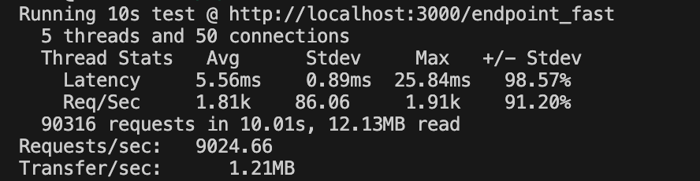

#### Locust
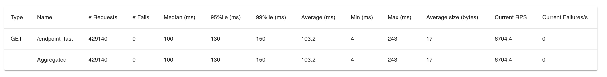
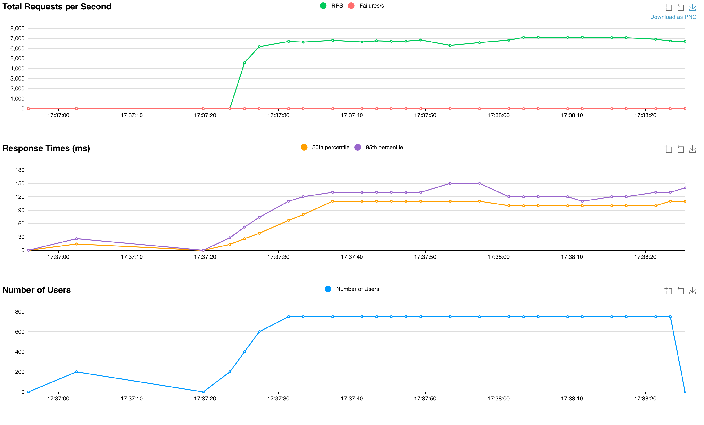


### Granian

#### wrk
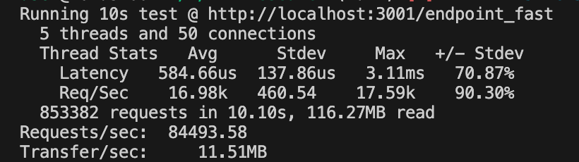

#### Locust
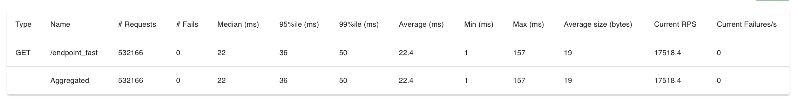
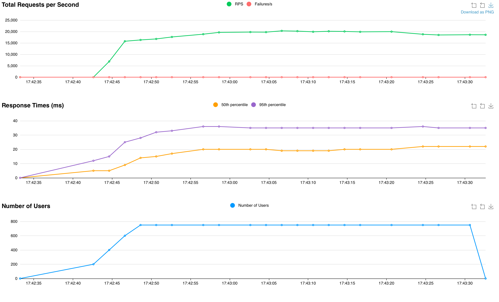

## Node.js

### Vanila

#### wrk
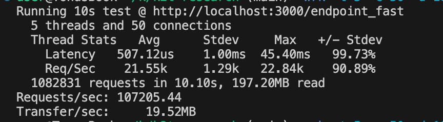

#### Locust
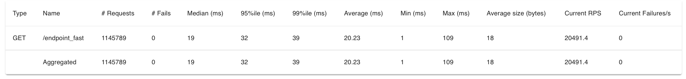
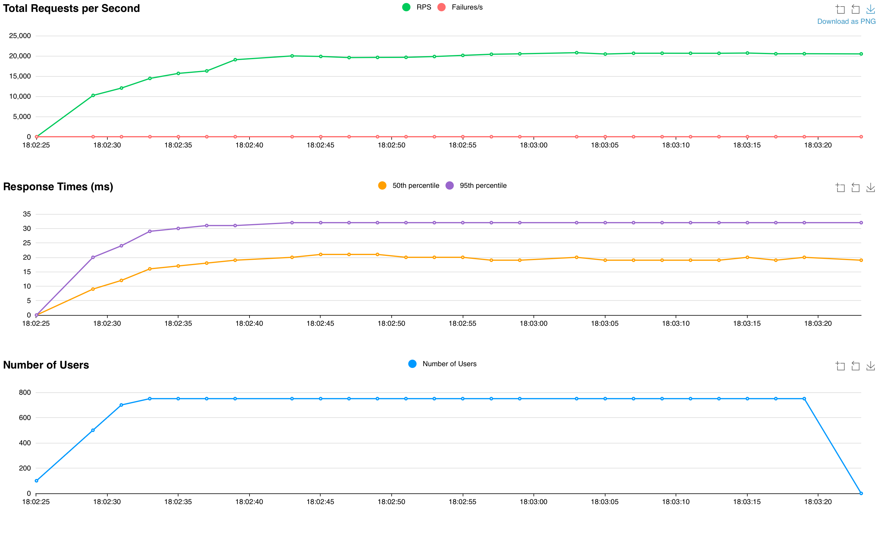

### Express

#### wrk
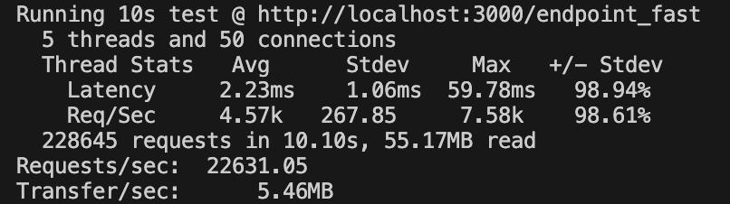

#### Locust
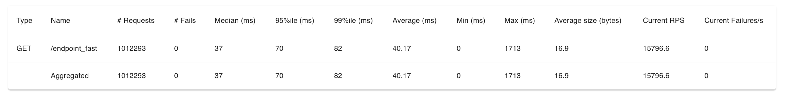
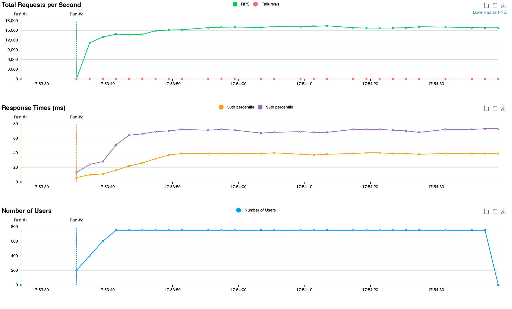

### Fastify

#### wrk
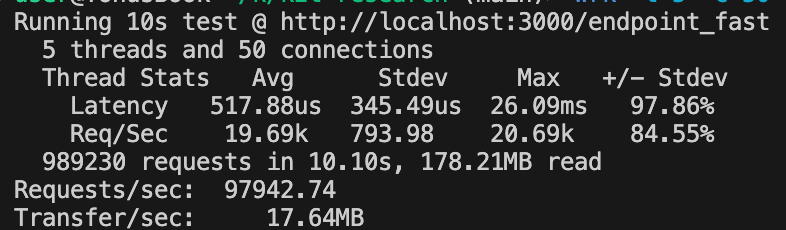

#### Locust
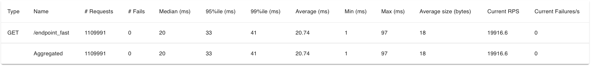
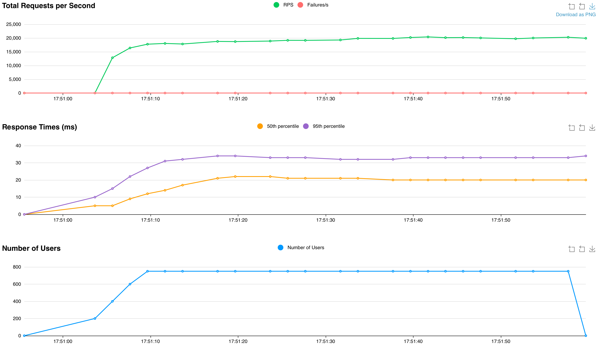

## Golang

### Vanila

#### wrk
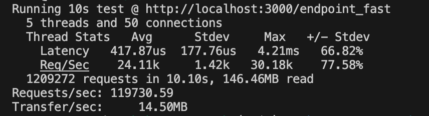

#### Locust
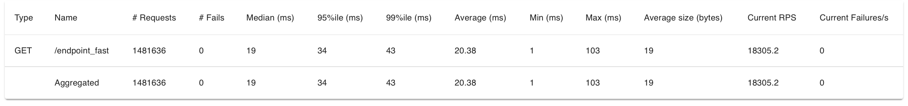
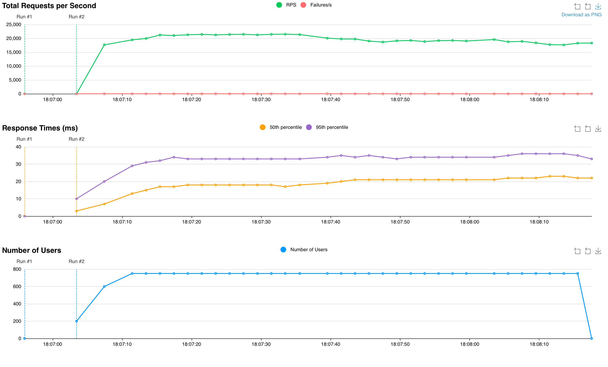

# Выводы

Выводы делайте сами, но со своей стороны скажу:
Явным лидером выстает GoLang с 119 к RPS по версии wrk теста. 
Второе место занимает NodeJS/Vanila, 
Третье место занимает Python/Granian

Как мне, каждый стек повел себя достойно кроме Node.js/express и Python/fastAPI

### Касаемо что выбрать для разработки сервисов: 

#### **Python** — удобство и скорость разработки

 **Когда использовать:**
- Проекты, где важна **быстрота разработки** (MVP, стартапы, прототипы).
- Машинное обучение, анализ данных, API для data science.
- Backend для небольших или средних нагрузок.
- Когда удобнее писать **асинхронный код** (FastAPI, AsyncIO).

**Когда НЕ использовать:**
- Высоконагруженные системы с миллионами запросов в секунду.
- Когда требуется минимальное потребление CPU и RAM.
- Если критична скорость выполнения запроса.

#### **Node.js** — баланс между скоростью и удобством

**Когда использовать:**
- **Высоконагруженные API и микросервисы**, где важна **скорость обработки I/O**.
- **Реальное время** (чаты, WebSocket, стриминг, колл-центры).
- Когда важна **экосистема** (много готовых библиотек).
- Когда команда уже знакома с **JavaScript** (универсальный стек: фронтенд + бэкенд).

**Когда НЕ использовать:**
- Если нужен **максимальный RPS** (есть накладные расходы на event loop).
- Когда критично важна многопоточность (Node.js работает в **одном потоке**, и только частично использует worker threads).

#### **Golang** — максимальная производительность и эффективность
 **Когда использовать:**
- **Супербыстрые API, микросервисы, высоконагруженные системы.**
- **Низкое потребление ресурсов.** Go использует меньше CPU и RAM по сравнению с Python и Node.js.
- **Высокая конкурентность.** Встроенная поддержка горутин (легковесных потоков).
- **Критически важные сервисы**, где отказоустойчивость и скорость — приоритет.

 **Когда НЕ использовать:**
- Если **нужен быстрый старт проекта** (разработка может быть медленнее, чем на Python/Node.js).
- Если важна **гибкость экосистемы** (в Go меньше готовых библиотек).